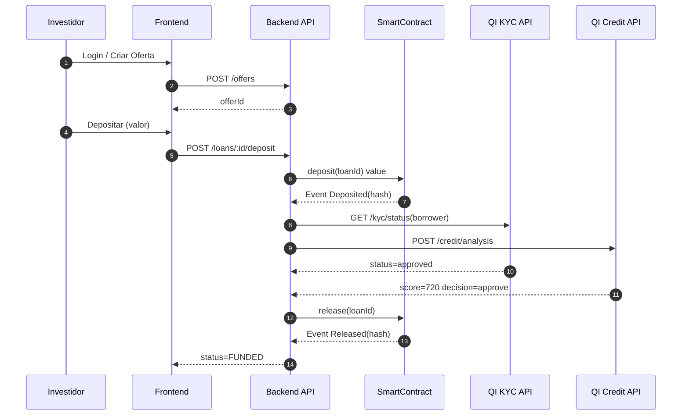
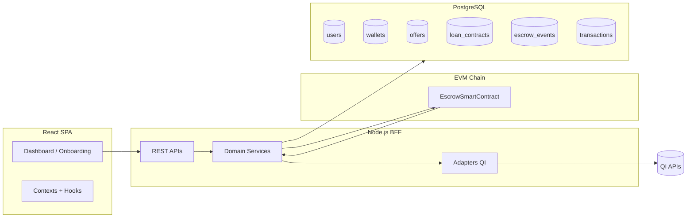
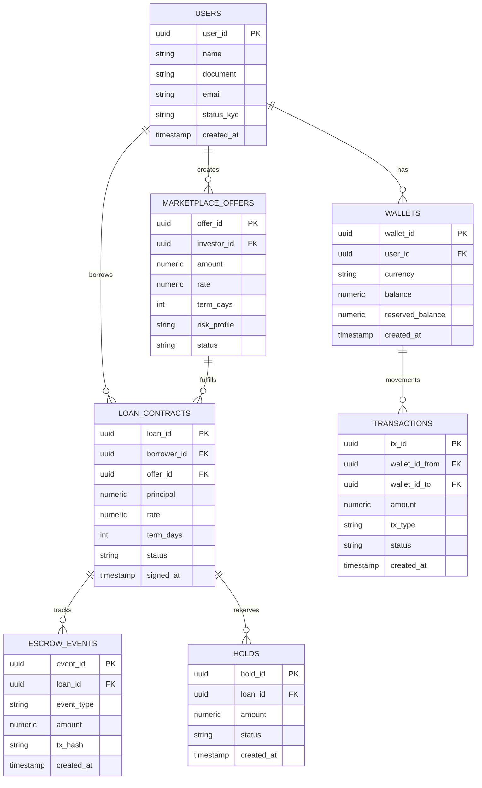
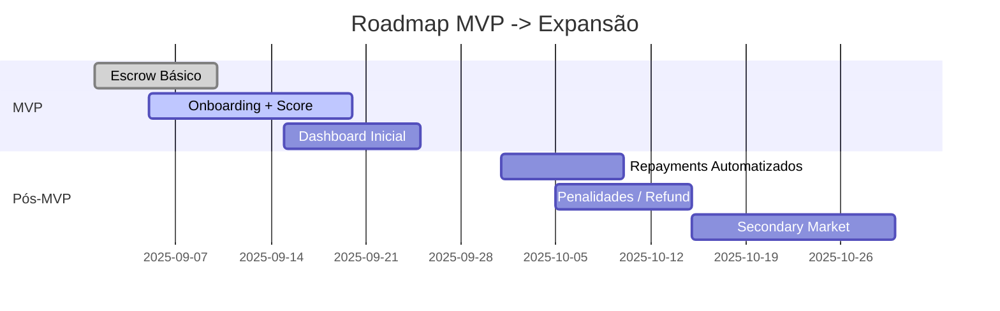

# 🌐 QI Credit – Plataforma P2P com Escrow On-Chain


> Infraestrutura P2P de crédito com escrow automatizado via smart contract e registro hash-only em blockchain para transparência, prova de existência e mitigação de risco.

## Navegação Rápida

- [Visão Geral](#visão-geral)
- [Fluxo End-to-End](#fluxo-end-to-end)
- [Arquitetura Resumida](#arquitetura-resumida)
- [Modelo de Dados](#modelo-de-dados-resumo)
- [Segurança (Resumo)](#segurança-resumo)
- [KPIs](#kpis-mvp)
- [Roadmap](#roadmap-resumido)
- [Testes](#testes)
- [Smart Contract (Didático)](#anexo-smart-contract-didático-atual-minimal)

### Documentação Detalhada

| Tópico              | Arquivo                                                                  | Descrição                                                                             |
| ------------------- | ------------------------------------------------------------------------ | ------------------------------------------------------------------------------------- |
| API Completa        | [`docs/api-specification.md`](docs/api-specification.md)                 | Endpoints por domínio (Onboarding, Crédito, Wallet, Escrow, Antifraude, Autenticação) |
| Arquitetura         | [`docs/architecture.md`](docs/architecture.md)                           | Camadas, componentes, decisões (ADRs), escalabilidade, riscos                         |
| Banco & DER         | [`docs/db.md`](docs/db.md)                                               | Modelo lógico, tabelas, índices, integridade, exemplos SQL                            |
| Fluxos & Estados    | [`docs/diagrams/flows.md`](docs/diagrams/flows.md)                       | Sequências, estados, reconciliação, journey                                           |
| Exemplos Backend    | [`docs/examples/backend-examples.md`](docs/examples/backend-examples.md) | Orquestração de empréstimo, escrow, curl scripts                                      |
| Segurança Front-end | [`docs/security-frontend.md`](docs/security-frontend.md)                 | Cookies seguros, XSS/CSRF, EIP-712, isolamentos                                       |
| Roadmap Estratégico | [`docs/roadmap.md`](docs/roadmap.md)                                     | Fases, backlog, riscos, métricas macro                                                |

> Em desenvolvimento futuro: KPIs detalhados (`docs/kpis.md`), guia de contribuição (`CONTRIBUTING.md`), fluxos API encadeados (`docs/examples/api-flows.md`).

## Visão Geral

O ecossistema de crédito P2P carece de transparência operacional: fundos são bloqueados de forma opaca, validações KYC/score são black-box e a execução contratual é lenta.

Diante disso, propomos a **QI Credit**, um fluxo auditável com o seguinte fluxo:

Depósito do investidor → validação regulatória/KYC/score → assinatura → liberação → pagamentos e eventos → auditoria em tempo real.

### Problema

Fragmentação entre: onboarding, análise, reserva de fundos e execução contratual. Falta uma “camada de confiança” neutra e verificável.

### Solução

1. Smart contract de escrow (hash-only events) + prova de fundos.
2. Backend integrando APIs QI (onboarding, score, wallet).
3. Marketplace P2P onde investidores criam ofertas e tomadores consomem.
4. Dashboard unificado com rastreabilidade e métricas operacionais.

### Diferenciais

- Hash-only: sem exposição de dados sensíveis on-chain.
- Prova de fundos antes da assinatura (reduce default risk).
- Eventos on-chain servindo como trilha imutável de execução.
- Extensível para secondary market / colateral no roadmap.
- Modular (cada domínio isolado em `apis/*`).

---

## Fluxo End-to-End

1. Investidor cria conta (KYC básico) e registra uma oferta (valor, taxa, prazo);
2. Tomador realiza onboarding + análise de crédito (score > threshold) - _significa que o crédito só é aprovado se a pontuação (score de crédito) for maior que um limite mínimo pré-definido (threshold)_
3. Plataforma cria `loanId` on-chain (estado inicial);
4. Investidor realiza `deposit(loanId)` → fundos bloqueados;
5. Assinatura digital off-chain (hash armazenado on-chain);
6. Backend valida: KYC + score + assinatura → chama `release(loanId)`;
7. Tomador recebe fundos e cronograma de pagamentos inicia;
8. Pagamentos/atrasos geram eventos e alimentam dashboard/KPIs.

### Sequence



---

## Arquitetura Resumida



---

## Modelo de Dados (Resumo)



---

## Guia de Instalação Completo

### Pré-requisitos

Antes de começar, certifique-se de ter instalado:

| Requisito | Versão Mínima | Como Instalar |
|-----------|---------------|---------------|
| **Node.js** | 18.x ou superior | [nodejs.org](https://nodejs.org/) |
| **npm** | 9.x ou superior | Vem com Node.js |
| **Git** | Qualquer versão recente | [git-scm.com](https://git-scm.com/) |
| **PostgreSQL** (opcional) | 14.x ou superior | [postgresql.org](https://www.postgresql.org/) ou usar Docker |

#### Verificar Instalações

```bash
# Verifique as versões instaladas
node --version    # deve mostrar v18.x.x ou superior
npm --version     # deve mostrar 9.x.x ou superior  
git --version     # qualquer versão recente
```

### Passo 1: Clonar o Repositório

```bash
# Clone o projeto
git clone <repo-url>
cd QI-Credit

# Verifique se está no diretório correto
ls -la # deve mostrar package.json, README.md, etc.
```

### Passo 2: Configurar Ambiente

```bash
# 1. Criar arquivo de configuração
npm run setup:env

# 2. Editar configurações (escolha seu editor preferido)
nano .env          # Editor nano (Linux/Mac)
# ou
code .env          # VS Code
# ou
vim .env           # Vim
```

**Configurações importantes no .env:**

```bash
# Banco de Dados - Configure sua senha PostgreSQL
DB_PASSWORD=sua_senha_aqui

# Desenvolvimento - Deixe como true para testes
QITECH_MOCK_MODE=true
BLOCKCHAIN_MOCK_MODE=true

# Produção - Configure apenas quando necessário
QITECH_API_KEY=sua_chave_qitech
PRIVATE_KEY=sua_private_key_blockchain
```

### Passo 3: InstalarDependências

```bash
# Instala todas as dependências (pode demorar alguns minutos)
npm run setup

# Se der erro, tente instalar separadamente:
npm install                    # Dependências raiz
cd backend && npm install     # Dependências backend  
cd ../frontend && npm install # Dependências frontend
cd ../blockchain && npm install # Dependências blockchain
cd ..                         # Voltar para raiz
```

### Passo 4: Configurar Banco de Dados

#### Opção A: PostgreSQL Local

```bash
# 1. Instale PostgreSQL se não tiver
# Ubuntu/Debian:
sudo apt update && sudo apt install postgresql postgresql-contrib

# macOS (Homebrew):
brew install postgresql
brew services start postgresql

# 2. Criar banco e usuário
sudo -u postgres psql
CREATE DATABASE qicredit_db;
CREATE USER postgres WITH ENCRYPTED PASSWORD 'password';
GRANT ALL PRIVILEGES ON DATABASE qicredit_db TO postgres;
\q

# 3. Executar migrações
npm run db:migrate
```

#### Opção B: Docker

```bash
# 1. Criar e iniciar container PostgreSQL
docker run --name postgres-qicredit \
  -e POSTGRES_DB=qicredit_db \
  -e POSTGRES_USER=postgres \
  -e POSTGRES_PASSWORD=password \
  -p 5432:5432 \
  -d postgres:14

# 2. Aguardar container inicializar (30 segundos)
sleep 30

# 3. Executar migrações
npm run db:migrate
```

### Passo 5: Executar o Projeto

```bash
# Inicia frontend e backend simultaneamente
npm run dev

# Ou execute separadamente:
npm run start:backend  # Backend na porta 3000
npm run start:frontend # Frontend na porta 8080
```

**Pronto! Acesse:**
- **Frontend**: http://localhost:8080
- **Backend API**: http://localhost:3000

### Scripts Disponíveis

| Comando | Descrição |
|---------|-----------|
| `npm run setup:env` | Cria .env a partir do .env.example |
| `npm run setup` | Instalação completa (dependências + migrações) |
| `npm start` | Inicia aplicação completa |
| `npm run dev` | Modo desenvolvimento com hot-reload |
| `npm run build` | Build de produção |
| `npm test` | Executa todos os testes |
| `npm run lint` | Verifica qualidade do código |
| `npm run clean` | Limpa cache e arquivos temporários |

### Resolução de Problemas

### 🐛 Resolução de Problemas

**Problemas comuns e soluções rápidas:**

#### PostgreSQL não conecta
```bash
# Docker (recomendado):
docker run --name postgres-qicredit -e POSTGRES_DB=qicredit_db -e POSTGRES_USER=postgres -e POSTGRES_PASSWORD=password -p 5432:5432 -d postgres:14

# Sistema local:
sudo systemctl start postgresql  # Linux
brew services start postgresql   # macOS
```

#### Portas ocupadas
```bash
# Verificar portas em uso
netstat -tulpn | grep :3000
netstat -tulpn | grep :8080

# Matar processo se necessário
kill -9 PID
```

#### Dependências com erro
```bash
npm run clean
npm run setup
```

**📋 Para problemas mais complexos, consulte o [Guia Completo de Troubleshooting](docs/troubleshooting.md)**

### Configurações de Produção

Para ambiente de produção, configure:

```bash
# No arquivo .env
NODE_ENV=production
QITECH_MOCK_MODE=false
BLOCKCHAIN_MOCK_MODE=false

# Configure as chaves reais:
QITECH_API_KEY=sua_chave_api_real
JWT_SECRET=gere_um_secret_forte
PRIVATE_KEY=sua_private_key_real
```

---

## Exemplo de Código – Backend (Handler Escrow Simplificado)

```javascript
// backend/controllers/escrowController.js (exemplo simplificado)
exports.deposit = async (req, res, next) => {
  const { loanId } = req.params;
  const { amount, investorWallet } = req.body;
  try {
    // 1. valida loan, status
    // 2. chama service que interage com smart contract via ethers.js
    const event = await req.services.escrow.deposit({
      loanId,
      amount,
      investorWallet,
    });
    res.status(201).json({ success: true, event });
  } catch (e) {
    next(e);
  }
};
```

```javascript
// backend/services/escrowService.js (trecho conceitual)
const { ethers } = require('ethers');
module.exports = ({ contractAddress, abi, provider, signer, db }) => ({
  async deposit({ loanId, amount, investorWallet }) {
    const contract = new ethers.Contract(contractAddress, abi, signer);
    const tx = await contract.deposit(loanId, {
      value: ethers.parseEther(amount.toString()),
    });
    const receipt = await tx.wait();
    const ev = receipt.logs.find(
      (l) => l.fragment && l.fragment.name === 'Deposited'
    );
    const eventHash = ev ? ev.args.eventHash : null;
    await db('escrow_events').insert({
      loan_id: loanId,
      event_type: 'DEPOSITED',
      amount,
      tx_hash: eventHash,
    });
    return { loanId, amount, txHash: eventHash };
  },
});
```

---

## Segurança (Resumo)

- Tokens somente em `httpOnly` cookies (evitar XSS token theft).
- Sanitização e validação (camada `middlewares/validation.js`).
- Rate limiting para endpoints sensíveis (`/auth`, `/deposit`).
- Hash-only on-chain evita exposição de PII.
- Logs estruturados + correlação de request-id.
- Planejado: assinatura digital dos contratos (hash canonical).

---

## KPIs (MVP)

| Métrica               | Descrição                         | Target Inicial |
| --------------------- | --------------------------------- | -------------- |
| Onboarding Time       | Tempo médio KYC aprovado          | < 5 min        |
| Approval Rate         | % loans liberados após depósito   | > 95%          |
| On-Time Payments      | % parcelas pagas no prazo         | > 90%          |
| Escrow Reconciliation | Eventos consistentes on/off chain | > 99%          |
| Funding Velocity      | Tempo depósito → liberação        | < 2 min        |

---

## Roadmap Resumido



---

## Testes

Estratégia:

- Unit: services isolados (mock providers).
- Integration: rotas + DB (containers).
- e2e: fluxo completo (Playwright).
- Smart contracts: Hardhat tests para estados e eventos.

---

## Licença

MIT – ver [`LICENSE`](LICENSE).

---

## ⚠️ Disclaimer

MVP focado em demonstrar viabilidade de escrow on-chain integrado ao ecossistema QI. Não substitui processos regulatórios completos, auditoria de contratos ou certificações de produção.

---

## Próximos Complementos

- Documentação completa de API's em `docs/api-specification.md`
- Diagramas adicionais [aqui](docs/diagrams).
- Migrations SQL refinadas com índices e constraints.
- Smart contract estendido com penalties & partial releases.

> Para detalhes aprofundados veja: `docs/architecture.md`, `docs/db.md`, `docs/roadmap.md`.

---

### Anexo: Smart Contract Didático Atual (Minimal)

```solidity
// SPDX-License-Identifier: MIT
pragma solidity ^0.8.19;

contract SimpleEscrow {
    address public platform;
    enum State { AWAITING_VALIDATION, FUNDS_LOCKED, RELEASED, REFUNDED }
    struct Loan {
        address investor;
        address borrower;
        uint256 amount;
        State state;
    }
    mapping(uint256 => Loan) public loans;
    uint256 public nextLoanId;

    event Deposited(uint256 loanId, address indexed investor, uint256 amount, bytes32 eventHash);
    event Released(uint256 loanId, address indexed borrower, uint256 amount, bytes32 eventHash);
    event Refunded(uint256 loanId, address indexed investor, uint256 amount, bytes32 eventHash);

    constructor() { platform = msg.sender; }

    function createLoan(address borrower) external returns (uint256) {
        require(msg.sender == platform, "only platform");
        loans[nextLoanId] = Loan(address(0), borrower, 0, State.AWAITING_VALIDATION);
        return nextLoanId++;
    }

    function deposit(uint256 loanId) external payable {
        require(msg.value > 0, "zero");
        Loan storage l = loans[loanId];
        require(l.amount == 0 && l.state == State.AWAITING_VALIDATION, "invalid");
        l.investor = msg.sender; l.amount = msg.value; l.state = State.FUNDS_LOCKED;
        emit Deposited(loanId, msg.sender, msg.value, keccak256(abi.encodePacked(loanId, msg.sender, msg.value, block.timestamp)));
    }

    function release(uint256 loanId) external {
        require(msg.sender == platform, "only platform");
        Loan storage l = loans[loanId];
        require(l.state == State.FUNDS_LOCKED, "state");
        l.state = State.RELEASED; payable(l.borrower).transfer(l.amount);
        emit Released(loanId, l.borrower, l.amount, keccak256(abi.encodePacked(loanId, l.borrower, l.amount, block.timestamp)));
    }

    function refund(uint256 loanId) external {
        require(msg.sender == platform, "only platform");
        Loan storage l = loans[loanId];
        require(l.state == State.FUNDS_LOCKED, "state");
        l.state = State.REFUNDED; payable(l.investor).transfer(l.amount);
        emit Refunded(loanId, l.investor, l.amount, keccak256(abi.encodePacked(loanId, l.investor, l.amount, block.timestamp)));
    }
}
```

---

## 🙏 Agradecimentos

Um agradecimento especial à equipe da **Poli Júnior** e à **QI TECH** pela oportunidade!

> Última atualização: 30/09/2025
