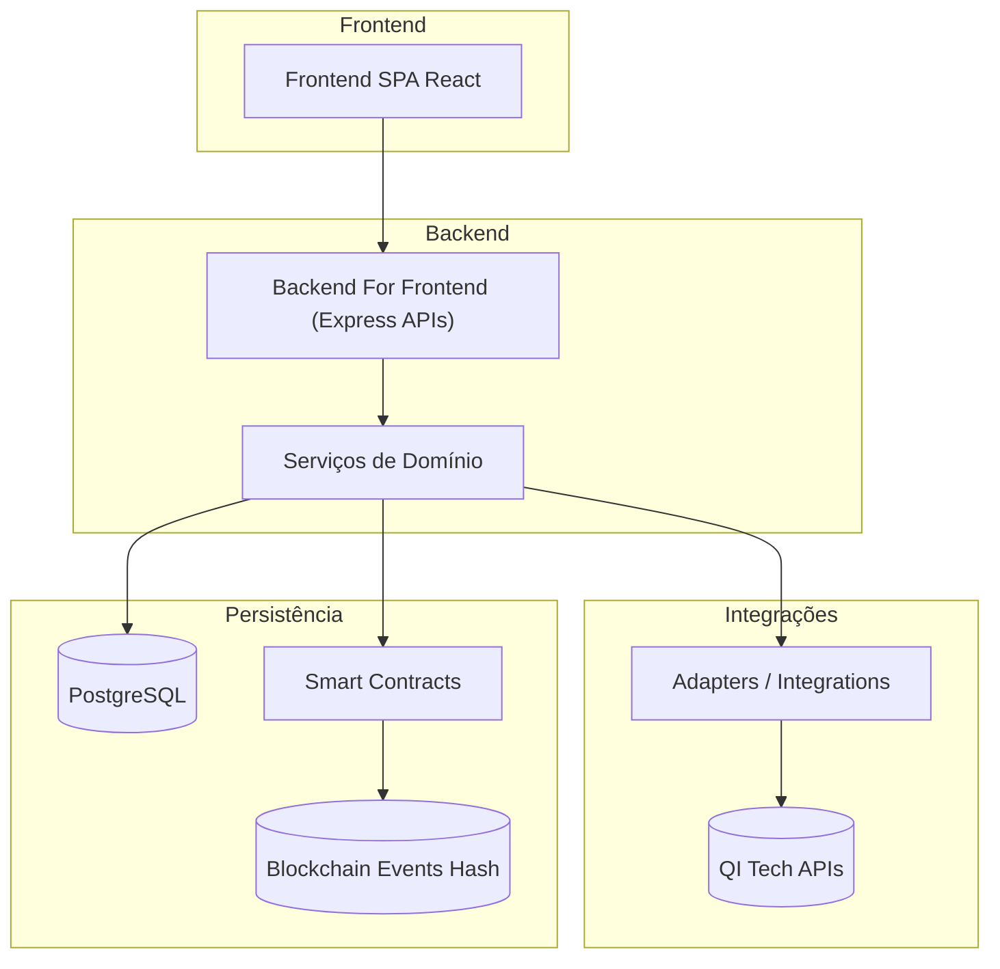
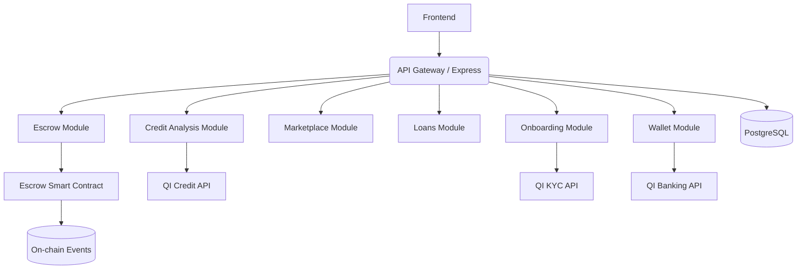
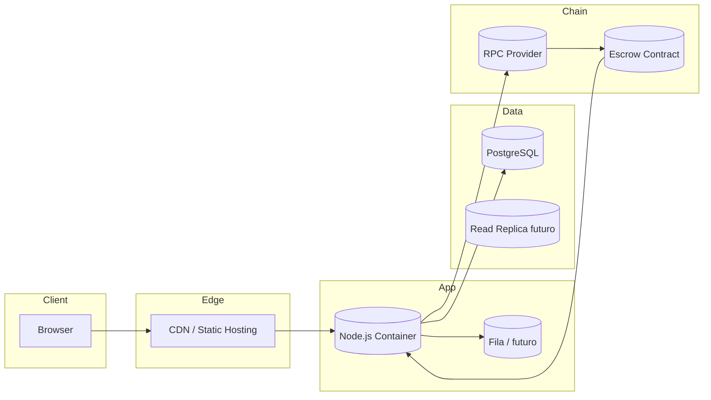
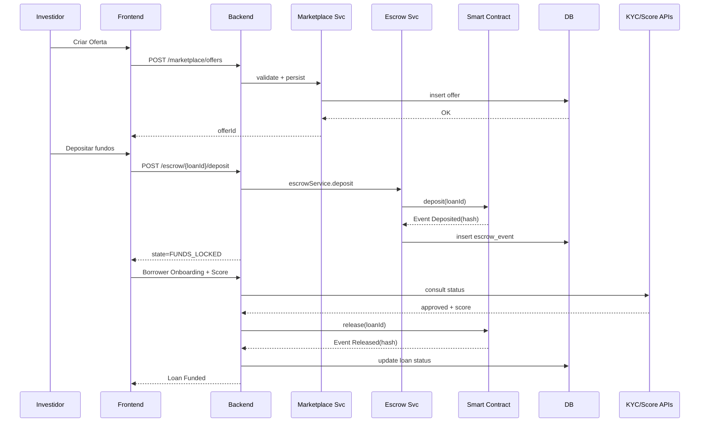
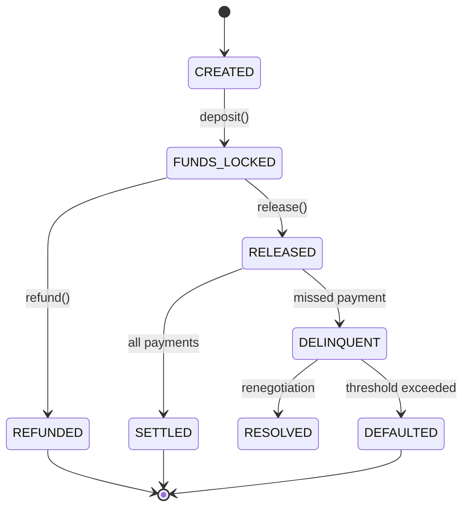

# Arquitetura – QI Credit

> Objetivo: Descrever visão lógica, física, responsabilidades, fluxos críticos e decisões arquiteturais do MVP de crédito P2P com escrow on-chain.

---

## 1. Visão Lógica (Camadas)

| Camada          | Responsabilidade                              | Exemplos                             |
| --------------- | --------------------------------------------- | ------------------------------------ |
| UI              | Interação usuário, KYC, dashboards            | React, Context API                   |
| BFF             | Routing, auth, validação, formatação resposta | Express, middlewares                 |
| Serviços        | Regras de negócio, orquestração               | escrowService, creditAnalysisService |
| Adapters        | Integrações externas / mocks                  | fraudKycService, bankingAsAService   |
| Smart Contracts | Escrow, transição de estados, eventos         | SimpleEscrow.sol                     |
| Persistência    | Estado off-chain, auditoria, relatórios       | Tabelas loans, escrow_events         |

---

## 2. Visão de Componentes

---

## 3. Deployment / Infra (Proposta)

---

## 4. Fluxo Crítico – Investidor → Escrow → Tomador

---

## 5. State Machine – Loan / Escrow

---

## 6. Principais Serviços (Contratos Internos)

| Serviço               | Funções Principais                       | Erros Clássicos              |
| --------------------- | ---------------------------------------- | ---------------------------- |
| onboardingService     | register, verify, status                 | DUPLICATE_EMAIL, KYC_PENDING |
| creditAnalysisService | analyze, fetchScore                      | SCORE_TIMEOUT                |
| marketplaceService    | createOffer, listOffers, matchOffer      | OFFER_NOT_FOUND              |
| loanService           | createFromOffer, sign, schedule          | LOAN_STATE_INVALID           |
| escrowService         | create, deposit, release, refund, events | ESCROW_ALREADY_DEPOSITED     |
| walletService         | deposit, transfer, reserve               | INSUFFICIENT_FUNDS           |

---

## 7. Decisões Arquiteturais (ADR Resumido)

| ID     | Decisão                          | Alternativa Rejeitada     | Justificativa                         |
| ------ | -------------------------------- | ------------------------- | ------------------------------------- |
| ADR-01 | Node.js monolito modular         | Microservices early       | Time curto hackathon + menor overhead |
| ADR-02 | Hash-only on-chain               | Dados completos on-chain  | Privacidade / LGPD / custo gas        |
| ADR-03 | Knex + SQL explícito             | ORM pesado (Sequelize)    | Controle fino + performance           |
| ADR-04 | EVM compatível (Scroll/Arbitrum) | L2 proprietário           | Ecosistema tooling maduro             |
| ADR-05 | Eventos como trilha              | Logs centralizados apenas | Imutabilidade + auditoria             |

---

## 8. Escalabilidade & Evolução

| Dimensão        | Estratégia Atual | Evolução Futuro               |
| --------------- | ---------------- | ----------------------------- |
| Leitura DB      | Índices básicos  | Read replicas / CQRS          |
| Escrita Crítica | Transações ACID  | Outbox + Event Sourcing       |
| Blockchain      | Single contract  | Modularização (EscrowFactory) |
| Processamento   | Request/response | Job assíncrono (fila)         |
| Observabilidade | Logs console     | OpenTelemetry + Prometheus    |

---

## 9. Segurança

- Validação de input em middleware.
- Minimização de superfícies (somente rotas necessárias).
- Hash eventos = `keccak256(loanId + payload + timestamp)` (não expõe PII).
- Planejado: assinatura digital das partes (ECDSA) off-chain + storage IPFS (hash referenciado).

---

## 10. Padrões de Código

- Controllers finos, Services gordos.
- Errors centralizados (factory + códigos).
- Funções puras onde possível (cálculo de cronograma).
- Nomeação: `snake_case` banco, `camelCase` aplicação.

---

## 11. Observabilidade (MVP)

| Item              | Status  | Próximo            |
| ----------------- | ------- | ------------------ |
| Request ID        | OK      | Correlation traces |
| Logs Estruturados | Parcial | JSON + níveis      |
| Métricas          | Pending | Latência endpoints |
| Alertas           | Pending | Thresholds SLA     |

---

## 12. Principais Riscos

| Risco                             | Impacto | Mitigação                            |
| --------------------------------- | ------- | ------------------------------------ |
| Falha RPC                         | Alto    | Retry + fallback provider            |
| Gas spikes                        | Médio   | Estimar e monitorar antes de release |
| Dados inconsistentes on/off chain | Alto    | Reconciliation job horário           |
| Atraso KYC externo                | Médio   | Timeout + fila para reprocesso       |

---

## 13. Próximas Extensões

1. Secondary Market (transfer IRR calculado).
2. Penalidades dinâmicas (tiered).
3. Motor de risco com features alternativos (open finance / redes sociais).
4. Modularidade de contratos (Upgradeable Proxy se necessário).

---

## 14. Referências

- `README.md` (fluxo macro)
- `db.md` (DER detalhado – em elaboração)
- `api-specification.md` (contratos HTTP)

---

> Última atualização: 30/09/2025
