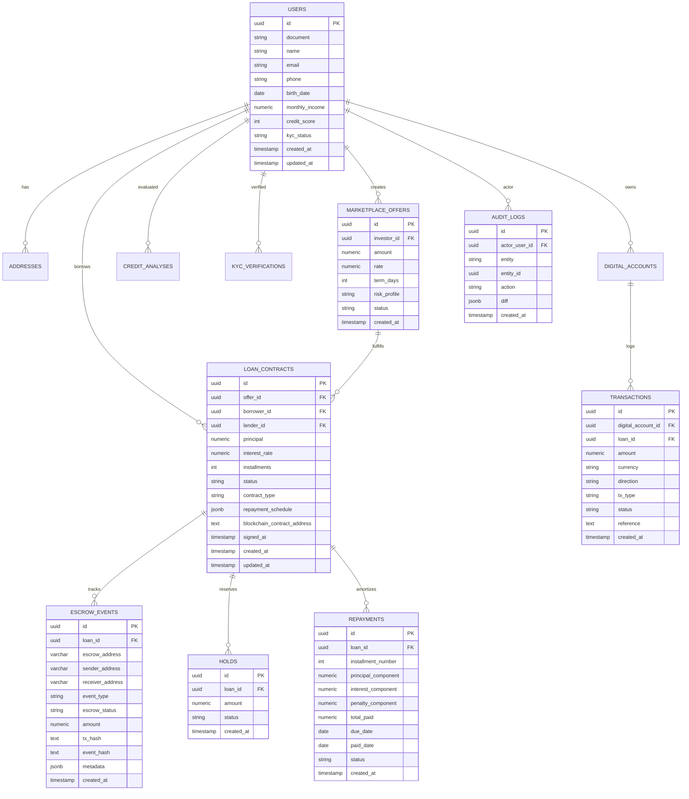

## Modelo de Dados

> Objetivo: Documentar estruturas, relacionamentos, integridade, índices e estratégias de evolução.

---

## 1. DER (Mermaid)



---

## 2. Tabelas & Campos (Detalhe)

### 2.1 `users`

| Campo                 | Tipo          | Regras            | Observações            |
| --------------------- | ------------- | ----------------- | ---------------------- |
| id                    | UUID          | PK                | gerado app             |
| document              | VARCHAR(20)   | UNIQUE NOT NULL   | CPF/CNPJ normalizado   |
| name                  | VARCHAR(160)  | NOT NULL          |                        |
| email                 | VARCHAR(160)  | UNIQUE NOT NULL   | lowercase index        |
| phone                 | VARCHAR(30)   |                   | e164                   |
| birth_date            | DATE          |                   |                        |
| monthly_income        | NUMERIC(18,2) |                   | base scoring           |
| credit_score          | INT           | DEFAULT NULL      | atualizado pós análise |
| kyc_status            | VARCHAR(32)   | DEFAULT 'PENDING' | enum lógico            |
| created_at/updated_at | TIMESTAMP     | NOT NULL          | default now()          |

### 2.2 `marketplace_offers`

Armazena propostas do investidor antes da criação do loan.

### 2.3 `loan_contracts`

Estados previstos: `DRAFT`, `PENDING_FUNDS`, `FUNDS_LOCKED`, `ACTIVE`, `DELINQUENT`, `REFUNDED`, `DEFAULT`, `SETTLED`.

### 2.4 `holds`

Reserva (prova de fundos) pré liberação definitiva.

### 2.5 `escrow_events`

Registra trilha completa on/off chain com dados blockchain detalhados.

| Campo | Tipo | Regras | Observações |
|-------|------|--------|-------------|
| id | UUID | PK | gerado app |
| loan_id | UUID | FK NOT NULL | referência ao empréstimo |
| escrow_address | VARCHAR(128) | NOT NULL | endereço do contrato escrow |
| sender_address | VARCHAR(128) | NULL | origem dos fundos |
| receiver_address | VARCHAR(128) | NULL | destino dos fundos |
| event_type | VARCHAR(32) | NOT NULL | DEPOSITED, RELEASED, REFUNDED, PENALTY |
| escrow_status | VARCHAR(32) | NOT NULL | estado atual consolidado |
| amount | NUMERIC(18,2) | NULL | valor da transação |
| tx_hash | TEXT | NULL | hash transação blockchain |
| event_hash | TEXT | NULL | hash do evento para verificação |
| metadata | JSONB | NULL | dados blockchain adicionais |
| created_at | TIMESTAMP | NOT NULL | timestamp do evento |

**Estados do `escrow_status`:**
- `PENDING`: Aguardando confirmação blockchain
- `DEPOSITED`: Fundos bloqueados com sucesso
- `RELEASED`: Fundos liberados para tomador
- `REFUNDED`: Fundos devolvidos ao investidor
- `FAILED`: Transação falhou

**Estrutura típica do `metadata`:**

```json
{
  "gas_used": 21000,
  "gas_price": "20000000000", 
  "block_number": 18450123,
  "block_timestamp": "2025-09-30T14:30:00Z",
  "confirmation_count": 12,
  "network": "ethereum",
  "contract_version": "1.0.0"
}
```

### 2.6 `repayments`

Granularidade por parcela; controle de componentes (principal/juros/multa) para cálculos de yield.

### 2.7 `transactions`

Ligação opcional com `loan_id` para mapear cashflow por contrato.

### 2.8 `audit_logs`

Permite comparar mutações (ex: atualização de status) via JSON diff.

---

## 3. Integridade Referencial

| FK                                                     | ON UPDATE | ON DELETE | Justificativa                              |
| ------------------------------------------------------ | --------- | --------- | ------------------------------------------ |
| offers.investor_id -> users.id                         | CASCADE   | RESTRICT  | Não remover histórico de ofertas           |
| loans.borrower_id -> users.id                          | CASCADE   | RESTRICT  | Loan persistente                           |
| loans.lender_id -> users.id                            | CASCADE   | SET NULL  | Possível transferência de posição          |
| escrow_events.loan_id -> loans.id                      | CASCADE   | CASCADE   | Eventos sem loan não fazem sentido         |
| repayments.loan_id -> loans.id                         | CASCADE   | CASCADE   | Remoção controlada em limpeza ambiente dev |
| holds.loan_id -> loans.id                              | CASCADE   | CASCADE   | Holds só existem com loan                  |
| transactions.digital_account_id -> digital_accounts.id | CASCADE   | RESTRICT  | preservar trilha                           |
| audit_logs.actor_user_id -> users.id                   | CASCADE   | SET NULL  | manter log mesmo sem usuário               |

---

## 4. Índices Recomendados

| Tabela             | Índice                                                           | Uso                           |
| ------------------ | ---------------------------------------------------------------- | ----------------------------- |
| users              | (document), (email)                                              | autenticação / lookup         |
| marketplace_offers | (status, risk_profile)                                           | listagens marketplace         |
| loan_contracts     | (status), (borrower_id), (lender_id), (offer_id)                | consultas dashboard           |
| escrow_events      | (loan_id, created_at), (escrow_address), (escrow_status)         | timeline eventos, auditoria   |
| repayments         | (loan_id, installment_number) UNIQUE                             | cálculo schedule              |
| transactions       | (loan_id), (digital_account_id, created_at)                      | extratos                      |
| audit_logs         | (entity, entity_id)                                              | auditoria                     |

---

## 5. Normalização & Uso de JSONB

- `repayment_schedule` (loan_contracts) em JSONB para armazenar snapshot calculado.
- `diff` em `audit_logs` como JSONB sparso (somente campos alterados).
- Evitar JSONB para campos consultados em filtros de alta frequência (ex: status).

---

## 6. Estratégias de Escalabilidade

| Área            | MVP       | Evolução                               |
| --------------- | --------- | -------------------------------------- |
| Particionamento | Não       | Particionar `escrow_events` por mês    |
| Replicação      | Não       | Read replica p/ relatórios             |
| Arquivamento    | Não       | Mover eventos > 2 anos p/ cold storage |
| Cache           | App-level | Redis para schedule / score            |

---

## 7. Segurança de Dados

- Criptografar documento (CPF/CNPJ) com chave de aplicativo (campo `document_enc`).
- Index auxiliar hash (sha256) para buscas sem expor valor claro.
- PII isolada somente em `users` / `addresses`.

---

## 8. Exemplo de Migrações (Esboço)

```sql
-- users
CREATE TABLE users (
	id UUID PRIMARY KEY,
	document VARCHAR(20) NOT NULL UNIQUE,
	name VARCHAR(160) NOT NULL,
	email VARCHAR(160) NOT NULL UNIQUE,
	phone VARCHAR(30),
	birth_date DATE,
	monthly_income NUMERIC(18,2),
	credit_score INT,
	kyc_status VARCHAR(32) DEFAULT 'PENDING',
	created_at TIMESTAMP NOT NULL DEFAULT NOW(),
	updated_at TIMESTAMP NOT NULL DEFAULT NOW()
);

CREATE TABLE marketplace_offers (
	id UUID PRIMARY KEY,
	investor_id UUID NOT NULL REFERENCES users(id),
	amount NUMERIC(18,2) NOT NULL,
	rate NUMERIC(9,6) NOT NULL,
	term_days INT NOT NULL,
	risk_profile VARCHAR(16),
	status VARCHAR(24) NOT NULL DEFAULT 'OPEN',
	created_at TIMESTAMP NOT NULL DEFAULT NOW()
);

CREATE TABLE loan_contracts (
	id UUID PRIMARY KEY,
	offer_id UUID REFERENCES marketplace_offers(id),
	borrower_id UUID REFERENCES users(id),
	lender_id UUID REFERENCES users(id),
	principal NUMERIC(18,2) NOT NULL,
	interest_rate NUMERIC(9,6) NOT NULL,
	installments INT NOT NULL,
	status VARCHAR(24) NOT NULL DEFAULT 'DRAFT',
	contract_type VARCHAR(24),
	repayment_schedule JSONB,
	blockchain_contract_address TEXT,
	signed_at TIMESTAMP,
	created_at TIMESTAMP NOT NULL DEFAULT NOW(),
	updated_at TIMESTAMP NOT NULL DEFAULT NOW()
);

CREATE TABLE holds (
	id UUID PRIMARY KEY,
	loan_id UUID NOT NULL REFERENCES loan_contracts(id) ON DELETE CASCADE,
	amount NUMERIC(18,2) NOT NULL,
	status VARCHAR(24) NOT NULL DEFAULT 'PENDING',
	created_at TIMESTAMP NOT NULL DEFAULT NOW()
);

CREATE TABLE escrow_events (
    id UUID PRIMARY KEY,
    loan_id UUID NOT NULL REFERENCES loan_contracts(id) ON DELETE CASCADE,
    escrow_address VARCHAR(128) NOT NULL,
    sender_address VARCHAR(128),
    receiver_address VARCHAR(128),
    event_type VARCHAR(32) NOT NULL,
    escrow_status VARCHAR(32) NOT NULL,
    amount NUMERIC(18,2),
    tx_hash TEXT,
    event_hash TEXT,
    metadata JSONB,
    created_at TIMESTAMP NOT NULL DEFAULT NOW()
);

CREATE TABLE repayments (
	id UUID PRIMARY KEY,
	loan_id UUID NOT NULL REFERENCES loan_contracts(id) ON DELETE CASCADE,
	installment_number INT NOT NULL,
	principal_component NUMERIC(18,2) DEFAULT 0,
	interest_component NUMERIC(18,2) DEFAULT 0,
	penalty_component NUMERIC(18,2) DEFAULT 0,
	total_paid NUMERIC(18,2) DEFAULT 0,
	due_date DATE NOT NULL,
	paid_date DATE,
	status VARCHAR(24) NOT NULL DEFAULT 'PENDING',
	created_at TIMESTAMP NOT NULL DEFAULT NOW(),
	UNIQUE(loan_id, installment_number)
);

CREATE TABLE transactions (
	id UUID PRIMARY KEY,
	digital_account_id UUID REFERENCES digital_accounts(id),
	loan_id UUID REFERENCES loan_contracts(id),
	amount NUMERIC(18,2) NOT NULL,
	currency VARCHAR(8) NOT NULL DEFAULT 'BRL',
	direction VARCHAR(8) NOT NULL, -- IN / OUT
	tx_type VARCHAR(32) NOT NULL,
	status VARCHAR(24) NOT NULL DEFAULT 'PENDING',
	reference TEXT,
	created_at TIMESTAMP NOT NULL DEFAULT NOW()
);

CREATE TABLE audit_logs (
	id UUID PRIMARY KEY,
	actor_user_id UUID REFERENCES users(id) ON DELETE SET NULL,
	entity VARCHAR(64) NOT NULL,
	entity_id UUID NOT NULL,
	action VARCHAR(64) NOT NULL,
	diff JSONB,
	created_at TIMESTAMP NOT NULL DEFAULT NOW()
);

CREATE INDEX idx_offers_status ON marketplace_offers(status);
CREATE INDEX idx_loans_status ON loan_contracts(status);
CREATE INDEX idx_events_loan ON escrow_events(loan_id, created_at);
CREATE INDEX idx_events_address ON escrow_events(escrow_address);
CREATE INDEX idx_events_status ON escrow_events(escrow_status);
CREATE INDEX idx_events_metadata ON escrow_events USING GIN(metadata);
CREATE INDEX idx_repayments_loan ON repayments(loan_id, installment_number);
CREATE INDEX idx_tx_loan ON transactions(loan_id);
CREATE INDEX idx_audit_entity ON audit_logs(entity, entity_id);

```

---

## 9. Consultas Exemplos

```sql
-- Parcelas em atraso > 10 dias
SELECT r.* FROM repayments r
JOIN loan_contracts l ON l.id = r.loan_id
WHERE r.status = 'PENDING' AND r.due_date < NOW() - INTERVAL '10 days';

-- Yield acumulado por investidor
SELECT l.lender_id, SUM(r.interest_component + r.penalty_component) AS total_yield
FROM repayments r
JOIN loan_contracts l ON l.id = r.loan_id
WHERE r.status = 'PAID'
GROUP BY l.lender_id;

-- Reconciliação básica eventos vs loan status
SELECT l.id, l.status, COUNT(e.id) AS total_events
FROM loan_contracts l
LEFT JOIN escrow_events e ON e.loan_id = l.id
GROUP BY l.id;

-- Auditoria completa de escrow por loan

SELECT 
  ee.event_type,
  ee.escrow_status,
  ee.amount,
  ee.sender_address,
  ee.receiver_address,
  ee.metadata->>'block_number' as block_number,
  ee.metadata->>'gas_used' as gas_used,
  ee.created_at
FROM escrow_events ee
WHERE ee.loan_id = 'uuid-do-loan'
ORDER BY ee.created_at;

-- Análise de gas por tipo de evento
SELECT 
  event_type,
  AVG((metadata->>'gas_used')::numeric) as avg_gas,
  COUNT(*) as total_events
FROM escrow_events 
WHERE metadata->>'gas_used' IS NOT NULL
GROUP BY event_type;

-- Eventos pendentes de confirmação blockchain
SELECT * FROM escrow_events 
WHERE escrow_status = 'PENDING' 
  AND created_at < NOW() - INTERVAL '10 minutes';
```

---

## 10. Próximos Passos (DB)

| Item                                         | Prioridade |
| -------------------------------------------- | ---------- |
| Migrações Knex gerar                         | Alta       |
| Criptografia document                        | Média      |
| Reconciliation job spec                      | Alta       |
| Índices tempo de execução (EXPLAIN baseline) | Média      |

---

> Última atualização: 30/09/2025
