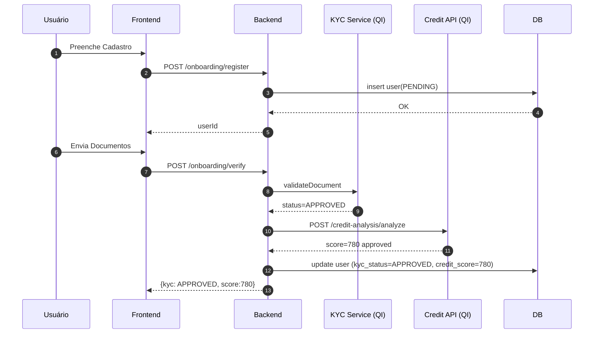
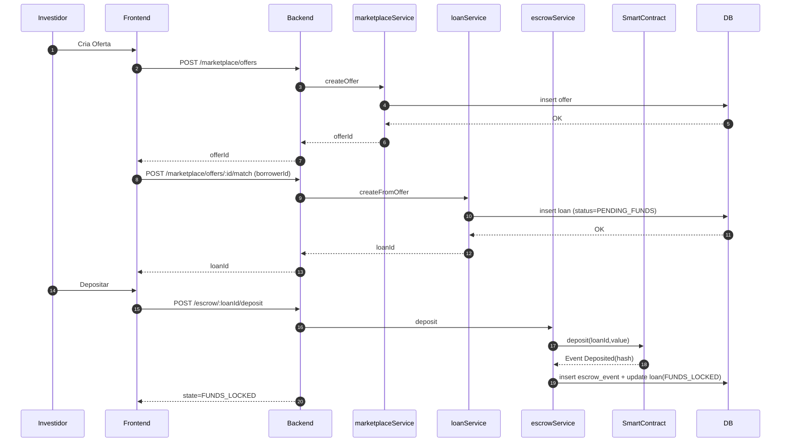
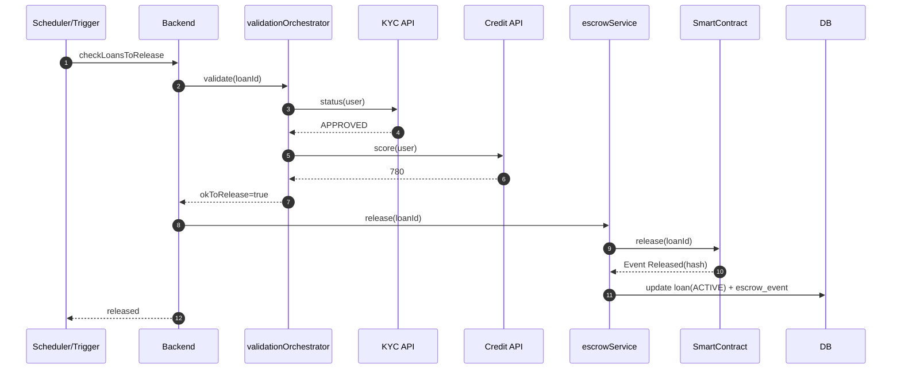
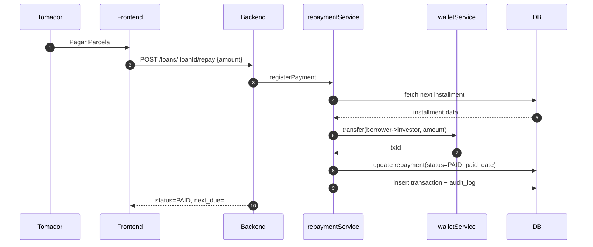
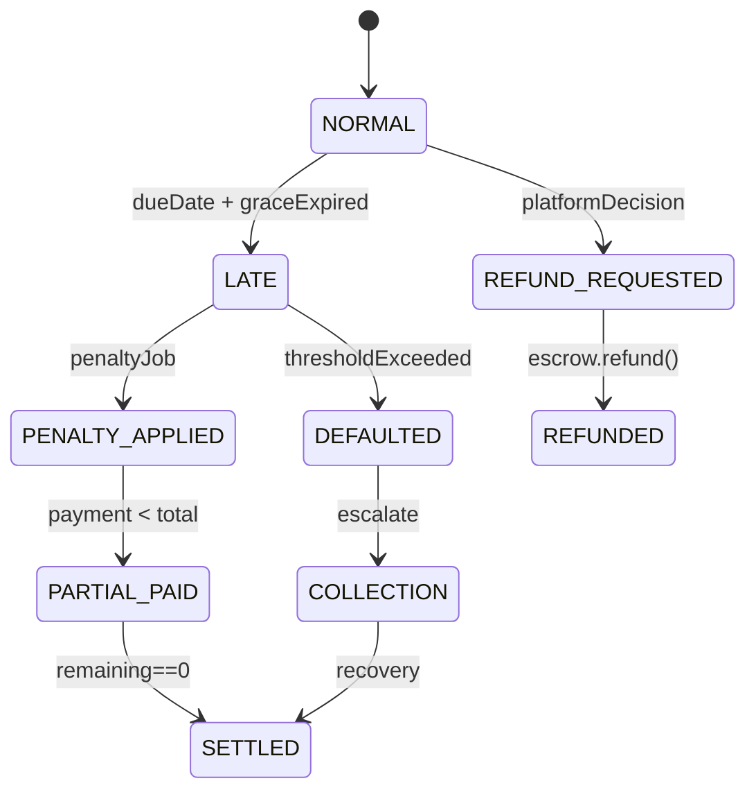
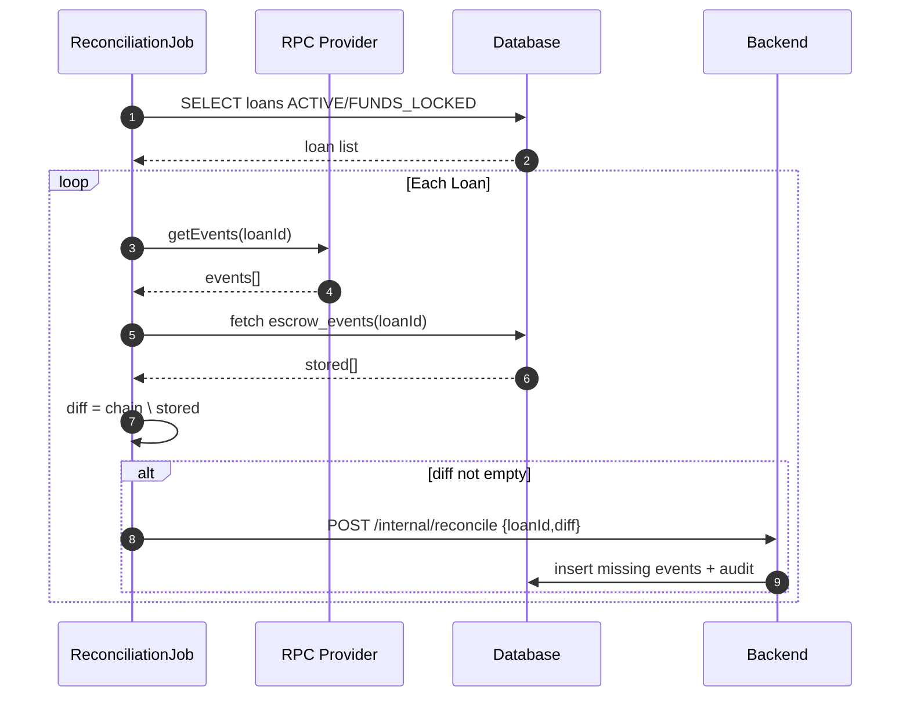
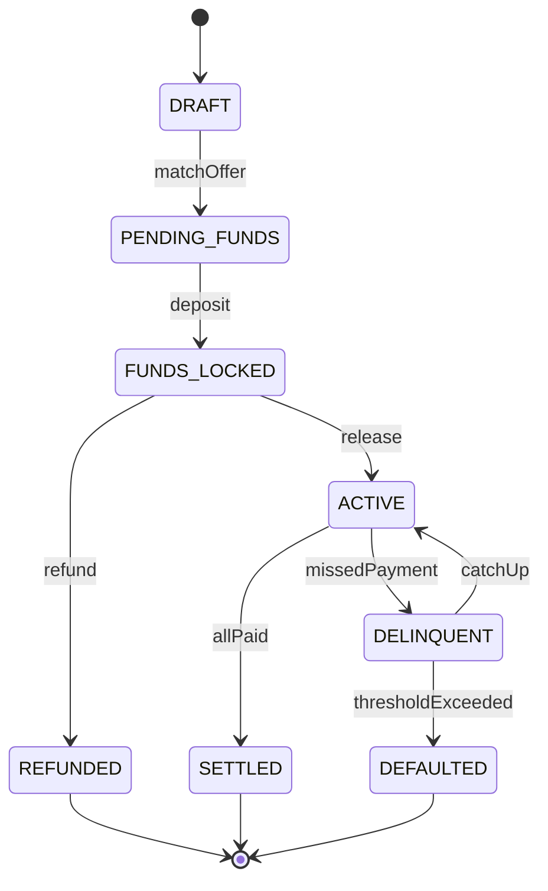

# Diagramas de Fluxo

---

## 1. Onboarding + KYC + Score

---

## 2. Funding (Oferta → Loan → Depósito Escrow)

---

## 3. Release (Validações → Liberação)

---

## 4. Repayment (Parcela Paga / Atraso)

---

## 5. Penalty / Refund Flow

---

## 6. Reconciliation (On-chain vs Off-chain)

---

## 7. Estados de Loan / Escrow (Consolidado)

---

## 8. Notas

- Diagramas servem como referência rápida para implementação / testes.
- Para adição futura: fluxo Secondary Market (transferência de posição) e fluxo de renegociação.
- Reconciliation é batch (ex: cron a cada 15 min) – pode evoluir para streaming com eventos on-chain.

> Atualizado 30/09/2025
