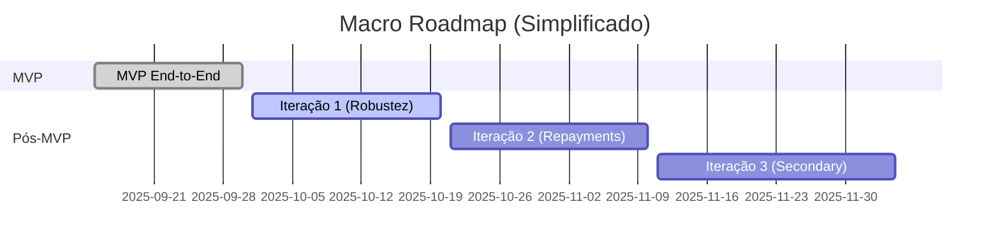

# Roadmap

## 1. North Star

Reduzir tempo e risco na originação de crédito P2P garantindo prova de fundos e audit trail on-chain (hash-only) sem expor dados sensíveis.

### KPIs Estratégicos (Alvo Pós-MVP)

| KPI                  | Definição                            | Target 90 dias |
| -------------------- | ------------------------------------ | -------------- |
| T_onboarding         | Tempo médio cadastro → KYC aprovado  | < 5 min        |
| Funding Velocity     | Depósito → Liberação fundos          | < 2 min        |
| On-Time Payments     | % parcelas pagas no prazo            | > 90%          |
| Escrow Consistency   | % eventos reconciliados on/off chain | > 99%          |
| Default Rate (early) | % loans em atraso > 30d              | < 5%           |

---

## 2. Fases

| Fase          | Janela (indicativa) | Objetivo Principal         | Entregáveis Chave                            | Exit Criteria                            |
| ------------- | ------------------- | -------------------------- | -------------------------------------------- | ---------------------------------------- |
| Hackathon MVP | Semana 1            | Provar fluxo end-to-end    | Onboarding, Oferta, Depósito Escrow, Release | 1 loan financiado (demo)                 |
| Iteração 1    | Semana 2-4          | Robustez e observabilidade | Logs estruturados, reconciliation job        | 0 inconsistências em 50 execuções teste  |
| Iteração 2    | Mês 2               | Repayments & Penalties     | State machine extendida, partial payments    | 95% cobertura testes domínio escrow/loan |
| Iteração 3    | Mês 3               | Escala e Secondary Market  | Transferência de posição, métricas avançadas | 10 loans simulados sem falhas            |

---

## 3. Gantt (Mermaid)

---

## 4. Backlog Priorizado (RICE Simplificado)

| ID    | Item                  | Fase Sug. | R (Reach) | I (Impact) | C (Confidence) | E (Effort) | Score |
| ----- | --------------------- | --------- | --------- | ---------- | -------------- | ---------- | ----- |
| BK-01 | Reconciliation Job    | Iter.1    | M         | Alto       | Médio          | M          | 30    |
| BK-02 | Penalties Engine      | Iter.2    | M         | Alto       | Médio          | M          | 30    |
| BK-03 | Partial Repayment     | Iter.2    | M         | Médio      | Alto           | M          | 28    |
| BK-04 | Secondary Market      | Iter.3    | Alto      | Alto       | Médio          | Alto       | 26    |
| BK-05 | Metrics Dashboard     | Iter.1    | M         | Médio      | Médio          | M          | 24    |
| BK-06 | Outbox Pattern        | Iter.2    | M         | Alto       | Médio          | Alto       | 22    |
| BK-07 | Event Signature ECDSA | Iter.3    | M         | Médio      | Médio          | Alto       | 18    |

Legenda: Alcance aproximado; qualitativo (Alto / M / Baixo) transformado em escore interno.

---

## 5. Detalhe das Fases

### 5.1 Hackathon MVP

Objetivo: Demonstração fluxo Investidor → Depósito → Validação KYC/Score → Liberação.  
Inclui: Smart contract básico, API modular, dashboard inicial.

### 5.2 Iteração 1 – Robustez & Observabilidade

Foco: Qualidade de dados, rastreabilidade, reduzir risco de divergência.  
Itens: Reconciliation job (escrow_events vs chain), request-id, métricas iniciais.

### 5.3 Iteração 2 – Repayments & Penalties

Adicionar: Cronograma, partial payment, cálculo pro-rata, penalidade atraso (ex: daily fee).  
Extensão state machine.

### 5.4 Iteração 3 – Secondary Market & Liquidez

Transferência de posição de investidor, cálculo de yield, registro hash de assignment.

---

## 6. Métricas por Entregável

| Entregável       | Métrica                       | Fonte           | Periodicidade |
| ---------------- | ----------------------------- | --------------- | ------------- |
| Reconciliation   | divergências (#/dia)          | job logs        | diário        |
| Repayments       | % parcelas registradas em <5s | eventos + clock | execução      |
| Secondary Market | tempo médio de transferência  | API logs        | por operação  |
| Penalties        | % incidência vs total loans   | DB (loans)      | semanal       |

---

## 7. Riscos & Mitigações

| Risco                       | Categoria    | Mitigação                                  |
| --------------------------- | ------------ | ------------------------------------------ |
| Divergência on/off chain    | Consistência | Job + hash dupla validação                 |
| Latência RPC                | Performance  | Retry exponencial + fallback RPC           |
| Crescimento schema rápido   | Dados        | Versionar migrações, migrações reversíveis |
| Atraso integrações externas | Externo      | Circuit breaker + cache último status      |
| Complexidade penalties cedo | Escopo       | Feature flag / togglable                   |

---

## 8. Critérios de Qualidade

| Área   | Critério MVP           | Meta Pós-MVP               |
| ------ | ---------------------- | -------------------------- |
| Testes | >50% core services     | >80% domínio crítico       |
| Lint   | Zero erros bloqueantes | Zero + style enforced      |
| Deploy | Manual                 | Script automatizado        |
| Logs   | Console estruturado    | Centralização + correlação |

---

## 9. Estratégia Técnica Evolutiva

| Tema          | Hoje              | Evolução                                        |
| ------------- | ----------------- | ----------------------------------------------- |
| Arquitetura   | Monolito modular  | Extração por bounded context se tráfego crescer |
| Eventos       | Tabela + on-chain | Event bus (Kafka)                               |
| Escrow        | Contrato único    | Factory + permissioning                         |
| Cálculo juros | Serviço interno   | Motor configurável (pricing engine)             |

---

## 10. Itens Fora do Escopo Imediato

- AML avançado / Sanctions screening completo.
- Storage documental em IPFS + notarização cruzada.
- Orquestração multi-chain/gas optimization automatizada.
- Motor de recomendação ML (investidor).

---

## 11. Próximas Ações (Check curto)

| Próximo                         | Responsável (placeholder) | ETA  |
| ------------------------------- | ------------------------- | ---- |
| Definir colunas reconciliation  | Tech Lead                 | D+3  |
| Especificar penalties param     | Produto                   | D+10 |
| Desenhar fluxo secondary market | Arquiteto                 | D+25 |

---

> Última atualização: 30/09/2025
